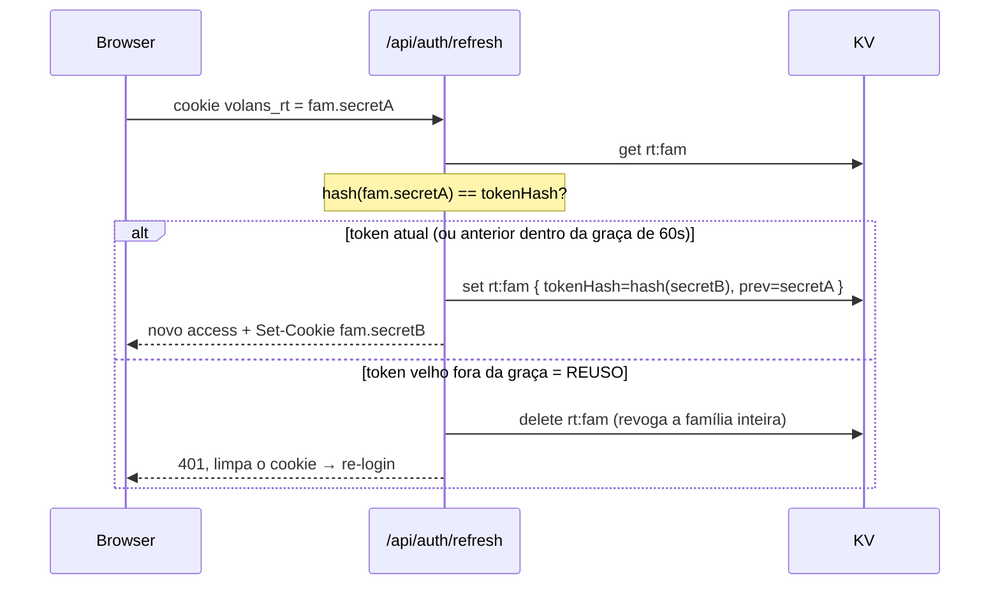

# Arquitetura — Fluxo de autenticação

Padrão híbrido cookieless: **access token em memória** (Bearer) + **refresh
token opaco** num único cookie path-scoped. Todos os handlers em
`apps/api/src/handlers/auth.ts`.

## O padrão de tokens

| Token | Formato | Onde vive | TTL | Conteúdo |
|---|---|---|---|---|
| **Access** | JWT HS256 (`jose`) | **memória** do front (store Zustand, sem persist) | `ACCESS_TTL` (~15min) | claims `sub` (userId), `fam` (familyId), `iss=volans-auth`, `aud=APP_NAME`, `exp` |
| **Refresh** | **opaco** `{familyId}.{secret 256-bit}` | **cookie** `httpOnly; Secure; SameSite=Strict; Path=/api/auth/refresh` | `REFRESH_TTL` (~7d, absoluto) | no KV guarda só o **SHA-256** do token; nunca em claro |

A claim `fam` no access token é o que liga o access à família de refresh — usada
para revogar a sessão no logout (o cookie não chega no `/logout` por ser
path-scoped) e para checar sessão viva (`isFamilyAlive`).

## Endpoints (contrato em `packages/contract`)

| Endpoint | O que faz |
|---|---|
| `POST /api/auth/register` | cria usuário (hash), envia e-mail de verificação, emite access+refresh. `emailVerified=false`. Erro `409 email_in_use` se duplicado. |
| `POST /api/auth/login` | valida; **erro genérico** (não diz se foi e-mail ou senha); bloqueia com `403` se e-mail não verificado; rate-limited. |
| `POST /api/auth/refresh` | usa o cookie; **rotaciona** o refresh e emite novo access; detecta reuso. |
| `POST /api/auth/logout` | revoga a família (via claim `fam`) e limpa o cookie. |
| `POST /api/auth/password/forgot` | **sempre 200** (sem enumeração); se existir, envia link single-use. |
| `POST /api/auth/password/reset` | valida token, troca o hash, **revoga TODAS as sessões** do usuário. |
| `POST /api/auth/verify-email` | marca `email_verified=true`. |
| `GET /api/auth/me` | usuário atual — exige access válido **E** família viva. |

## Detalhes por fluxo

### Register
Zod → rate-limit (`register`, por IP) → checa duplicado → hash Argon2id →
`INSERT users` → gera token de verificação (256-bit, guarda só o SHA-256) →
envia e-mail → abre sessão (access no body + refresh no cookie). O usuário já
entra logado, mas **login futuro exige e-mail verificado** (default do brief).

### Login
Zod → rate-limit (`login`, por IP **e** por conta) → busca usuário.
- Sem usuário: roda uma **verificação de hash fantasma** (`equalizeTiming`) para
  igualar o tempo de resposta e não vazar existência por timing → `401` genérico.
- Senha errada → `401` genérico idêntico.
- E-mail não verificado (só se a senha estiver certa) → `403 email_not_verified`.
- OK → abre sessão.

### Refresh — rotação + detecção de reuso
Cada refresh **rotaciona** o token da família. O KV guarda, por família:
`{ userId, tokenHash, prevTokenHash, prevExpiresAt, expiresAt }`.

- **Janela de graça (`REFRESH_GRACE`, 60s):** o token da geração imediatamente
  anterior é aceito por 60s. Sem isso, uma navegação que aborta a resposta do
  refresh (o `Set-Cookie` novo se perde) deixaria o browser com o token antigo e
  o próximo refresh seria tratado como ataque, derrubando um usuário legítimo.
- **Reuso:** um token de 2+ gerações atrás, ou fora da janela, com a família
  ainda viva → alguém tem uma cópia → **revoga a família inteira** e força
  re-login. Coberto por teste unit, de integração e e2e.
- Expiração da família é **absoluta**: rotacionar não estende o `REFRESH_TTL`.

### Logout
O cookie é path-scoped a `/api/auth/refresh` e **não chega** no `/logout`. A
família vem da claim `fam` do access token (aceito mesmo **expirado** — revogação
é benigna). Revoga a família (`rt:{fam}`) e envia `Set-Cookie` de limpeza.

### Forgot / Reset
- `forgot`: **sempre 200**. Se a conta existir, gera token de reset (256-bit,
  single-use, TTL curto, só o SHA-256 no banco) e envia o link. Rate-limited por
  IP e por conta.
- `reset`: valida o token (não usado, não expirado) → marca `used_at` → troca o
  hash → **`revokeAllForUser`** (derruba todas as sessões — a conta pode estar
  comprometida).

## Sessão viva (`authenticate`)
Endpoints autenticados (`/me`, consent) não confiam só na assinatura/expiração do
JWT: checam que a **família ainda existe no KV** (`isFamilyAlive`). Assim, um
access token roubado morre no instante da revogação (logout/reset), não em até
`ACCESS_TTL` depois. Custo: 1 leitura de KV por request.

## No front (`apps/web/src/lib`)
- `authStore` (Zustand, **sem persist**): access token em memória, `user`,
  `sessionEpoch`.
- Interceptor: anexa `Bearer`; num `401` tenta `refresh` **uma vez** e repete;
  refresh concorrente é deduplicado (uma promessa compartilhada); no boot,
  restaura a sessão pelo cookie. O `sessionEpoch` descarta um refresh em voo se
  o usuário deslogou no meio.
