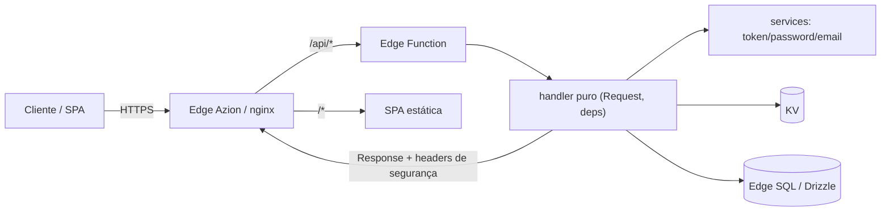

# Arquitetura — Visão geral

Boilerplate de autenticação **production-ready** sobre a borda da Azion. Um
monorepo (npm workspaces) com quatro peças e uma regra central: **os handlers
são funções puras** e rodam sem mudança em dois runtimes diferentes.

## Monorepo

```
apps/web         SPA React + Vite + Tailwind (CSR)          → o app atrás do login
apps/api         Next (SÓ route handlers = REST headless)   → a API em Node/Docker
apps/api-edge    Entry da Edge Function da Azion            → os MESMOS handlers na borda
packages/contract Zod schemas + client fetch tipado + OpenAPI → contrato compartilhado
infra/azion      Terraform + scripts de provisionamento     → o deploy na borda
```

- **apps/web** consome só o `packages/contract` (client tipado, schemas Zod).
- **apps/api** expõe os endpoints como route handlers do Next (sem páginas).
- **apps/api-edge** importa os handlers do `apps/api` e os roteia num entry de
  edge function — o Next fica de fora do isolate.
- **packages/contract** é a fonte única da verdade do contrato REST (mesmos
  schemas validam no front e no back).

## As camadas da API

Cada request passa por camadas finas, e cada uma tem uma responsabilidade:

```
route.ts (wrapper 1 linha)          →  export const POST = (req) => handleX(req, getDeps())
   │
handler puro (Request, deps) => Response   →  Zod → rate-limit → lógica → resposta padronizada
   │
services (passwordService, tokenService, emailService)   →  regras de negócio isoladas
   │
conectores (Drizzle Db, KV, EmailProvider, ...)   →  interfaces plugáveis (ver connectors.md)
```

O `route.ts` só injeta as dependências e chama o handler. **Toda a lógica vive
em handlers puros** `(Request, deps) => Response` — sem `next/*`, sem globais.
Por isso são testáveis direto no vitest (Request → Response) e reutilizáveis na
borda.

## Os dois runtimes (a decisão central)

O mesmo código roda em dois lugares, e isso molda toda a arquitetura:

| Runtime | Entry | Pode usar | Deploy |
|---|---|---|---|
| **Node/Docker** | `apps/api` (Next) | tudo (`node:*`, TCP, libs nativas) | container/servidor |
| **Borda Azion** | `apps/api-edge` (isolate V8) | **só web-standard** (`fetch`, WebCrypto, Request/Response) | edge function |

**Por que os handlers são puros:** eles dependem só da interface `HandlerDeps`
(`{ db, kv, email, storage, images, passwords, tokens, env }`), nunca da
implementação. Quem monta esse objeto é o injetor de cada runtime:

- `apps/api/src/handlers/deps.ts` → `getDefaultDeps()` (Node)
- `apps/api-edge/src/edgeDeps.ts` → `getEdgeDeps(args)` (borda)

Cada injetor escolhe os **adapters** por variável de ambiente. Trocar o backing
(SQLite→Redis, stub→Resend) é configuração, não código. Detalhes em
[`connectors.md`](connectors.md).

## O ciclo de uma requisição



A borda (nginx no Docker / Rules Engine na Azion) roteia `/api/*` para a função
e `/*` para a SPA, e serve os headers de segurança (CSP estrita, HSTS). Ver
[`edge-azion.md`](edge-azion.md).

## Onde olhar

- Contrato REST e schemas: `packages/contract/src/` → [`auth-flow.md`](auth-flow.md)
- Modelo de segurança: [`security.md`](security.md)
- Conectores e como estender: [`connectors.md`](connectors.md)
- Tabelas e chaves do KV: [`data-model.md`](data-model.md)
- Ressalvas de produção: [`../../PRODUCTION.md`](../../PRODUCTION.md)
